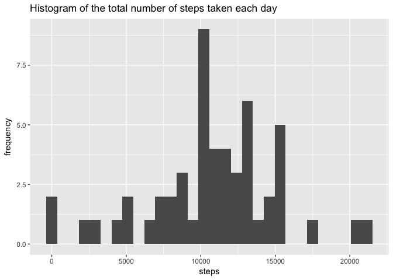
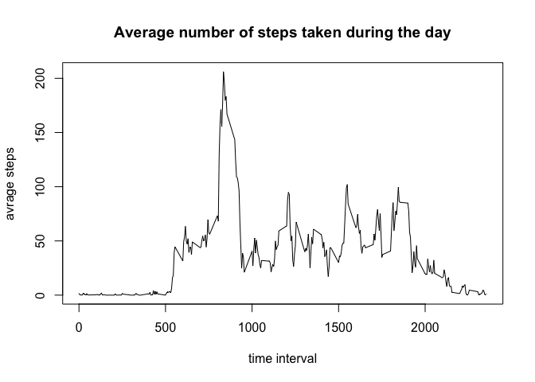

# Project 1- Week 2 Reproducible Research


## 1. Code for reading in the dataset and/or processing the data


```r
library(plyr); library(ggplot2);
setwd("/Users/Nael/Desktop/Coursera/5. Reproductible research/Week 2")
raw_data<-read.csv("activity.csv", header = TRUE)
data<-raw_data[!is.na(raw_data[,1]),] 
dim(data); summary(data)
```

```
## [1] 15264     3
```

```
##      steps                date          interval     
##  Min.   :  0.00   2012-10-02:  288   Min.   :   0.0  
##  1st Qu.:  0.00   2012-10-03:  288   1st Qu.: 588.8  
##  Median :  0.00   2012-10-04:  288   Median :1177.5  
##  Mean   : 37.38   2012-10-05:  288   Mean   :1177.5  
##  3rd Qu.: 12.00   2012-10-06:  288   3rd Qu.:1766.2  
##  Max.   :806.00   2012-10-07:  288   Max.   :2355.0  
##                   (Other)   :13536
```

## 2. Histogram of the total number of steps taken each day


```r
TotalStepsPerDay <- aggregate(data$steps, by=list(data$date), sum)  
names(TotalStepsPerDay)<-c("date","totalsteps")  # adjust column names
head(TotalStepsPerDay)  # data frame containing total steps for ech day
```

```
##         date totalsteps
## 1 2012-10-02        126
## 2 2012-10-03      11352
## 3 2012-10-04      12116
## 4 2012-10-05      13294
## 5 2012-10-06      15420
## 6 2012-10-07      11015
```

```r
qplot(TotalStepsPerDay$totalsteps, bins=30)+
        labs(title = "Histogram of the total number of steps taken each day", x = "steps", y = "frequency") 
```

<!-- -->

```r
# as alternative: hist(TotalStepsPerDay$totalsteps, main="Histogram")
```

## 3. Mean and median number of steps taken each day

```r
mean(TotalStepsPerDay$totalsteps, na.rm = T)  # mean of the total number of steps taken per day
```

```
## [1] 10766.19
```

```r
median(TotalStepsPerDay$totalsteps, na.rm = T) # median of the total number of steps taken per day
```

```
## [1] 10765
```

## 4. Time series plot of the average number of steps taken

```r
AverageStepsPerTimeInterval<-aggregate(data$steps, by=list(data$interval), mean)
names(AverageStepsPerTimeInterval)<-c("interval","average steps")  # adjust column names
plot(AverageStepsPerTimeInterval[,1],AverageStepsPerTimeInterval[,2], type="l", xlab = "time interval", ylab="avrage steps", main="Average number of steps taken during the day")
```

<!-- -->

# 5. The 5-minute interval that, on average, contains the maximum number of steps

```r
interval_index<-AverageStepsPerTimeInterval[,2]==(max(AverageStepsPerTimeInterval[,2]))
AverageStepsPerTimeInterval[interval_index,1]
```

```
## [1] 835
```

## 6. Code to describe and show a strategy for imputing missing data

```r
length(raw_data[is.na(raw_data[,1]),1]) # number of rows with missing values
```

```
## [1] 2304
```
Strategy: Use mean interval steps from **AverageStepsPerTimeInterval** for that interval.

```r
raw_data2<-merge(raw_data, AverageStepsPerTimeInterval, by="interval", all = TRUE)
raw_data2<-arrange(raw_data2,date,interval)   
NAs_vector<-is.na(raw_data2[,2])
raw_data2[NAs_vector,2]<-raw_data2[NAs_vector,4]
data_without_NAs<-raw_data2[,c(1,2,3)]  # new dataset that is equal to the original dataset but with the missing data filled in.
```

## 7. Histogram of the total number of steps taken each day after missing values are imputed

```r
TotalStepsPerDay2 <- aggregate(data_without_NAs$steps, by=list(data_without_NAs$date), sum)  
names(TotalStepsPerDay2)<-c("date","totalsteps")  # adjust column names

qplot(TotalStepsPerDay2$totalsteps, bins=30)+ 
         labs(title = "Histogram of the total number of steps taken each day", x = "steps", y = "frequency")
```

<!-- -->
Mean and median on new data:

```r
mean(TotalStepsPerDay2$totalsteps, na.rm = FALSE)
```

```
## [1] 10766.19
```

```r
median(TotalStepsPerDay2$totalsteps, na.rm = FALSE)
```

```
## [1] 10766.19
```
The effect of using mean data per interval as a data impute method for missing values seems to push overall data towards the mean.

## 8. Panel plot comparing the average number of steps taken per 5-minute interval across weekdays and weekends

We will work with the missing data imputed

```r
data_without_NAs$date <- as.Date(as.character(data_without_NAs$date))
data_without_NAs[,4]<-weekdays(data_without_NAs[,3])
data_without_NAs[,5]<-ifelse(data_without_NAs[,4]=="Sunday"|data_without_NAs[,4]=="Saturday", "Weekend", "Weekday")
names(data_without_NAs)[c(4,5)]<-c("day of the week", "weekday/weekend")
comparison<-aggregate(data_without_NAs$steps, by=list(data_without_NAs$`weekday/weekend`, data_without_NAs$interval), mean)
names(comparison)<-c("weekday_weekend", "interval", "average_steps")

ggplot(comparison, aes(x = interval, y=average_steps, color=weekday_weekend)) +
        geom_line() +
        facet_grid(weekday_weekend ~ .) +
        labs(title = "Mean of Steps by Interval", x = "time interval", y = "steps")
```

<!-- -->


